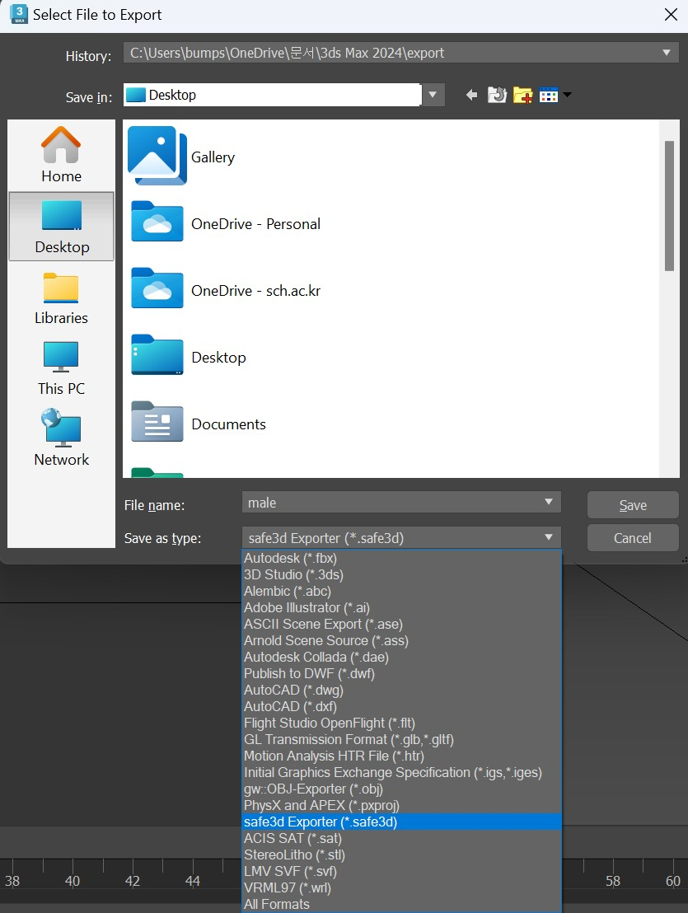
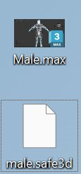

# safe99 max plugin
- 3ds max exporter 지원

- 3ds max importer 지원 예정

## .safe3d
.safe3d는 safe99의 3D 모델링 확장자입니다.

``` c
typedef struct safe3d
{
    char magic[8]; // "safe3d"

    int num_vertices;
    int num_indices;
} safe3d_t;
```

.safe3d의 가장 처음으로 오는 8바이트는 magic number, 그 다음 4바이트는 버텍스 개수, 그 다음 4바이트는 인덱스의 개수입니다.

이 뒤에 있는 데이터는 x, y, z로 구성된 버텍스 위치가 버텍스 개수만큼 저장 되고, 마지막엔 4바이트로 구성된 인덱스가 저장 됩니다.

## max exporter
3ds max로부터 .safe3d 확장자를 가진 모델 파일 익스포터

3ds max에서 safe3d Exporter로 저장하면 아래 사진처럼 저장됩니다.


