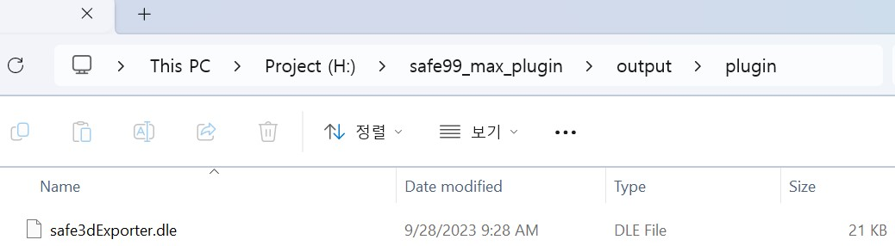
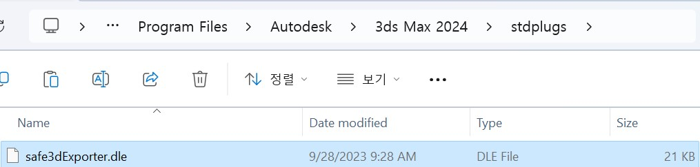
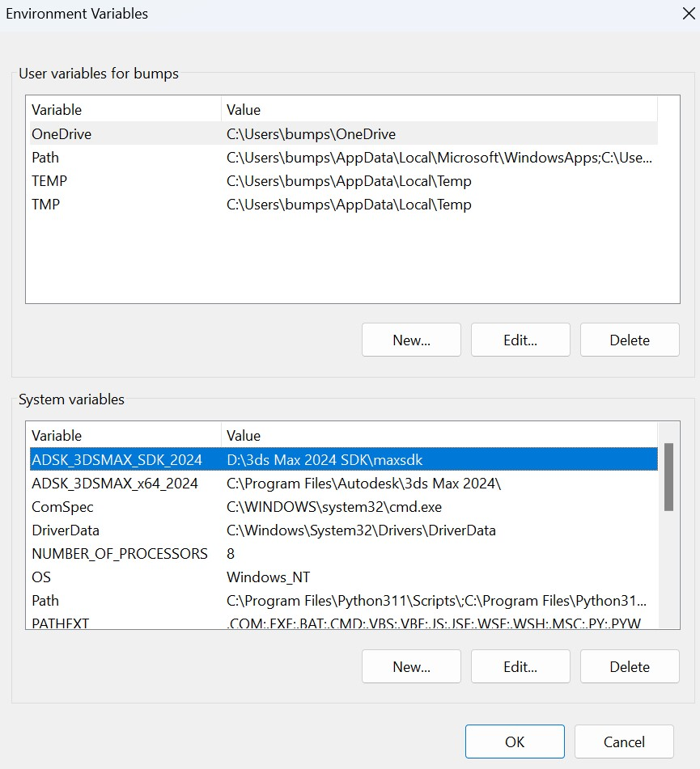

# safe99 max plugin
- 3ds max exporter 지원

- 3ds max importer 지원 예정

## .safe3d
.safe3d는 safe99의 3D 모델링 확장자입니다.

``` c
typedef struct safe3d
{
    char magic[8]; // "safe3d"

    int num_vertices;
    int num_indices;
} safe3d_t;
```

.safe3d의 가장 처음으로 오는 8바이트는 magic number, 그 다음 4바이트는 버텍스 개수, 그 다음 4바이트는 인덱스의 개수입니다.

이 뒤에 있는 데이터는 x, y, z로 구성된 버텍스 위치가 버텍스 개수만큼 저장 되고, 마지막엔 4바이트로 구성된 인덱스가 저장 됩니다.

## max exporter
3ds max로부터 .safe3d 확장자를 가진 모델 파일 익스포터

3ds max에서 safe3d Exporter로 저장하면 아래 사진처럼 저장됩니다.


## 3ds max에 플러그인 추가하기
1. output/plugin에 있는 .dle 파일 복사

    

1. 3ds max 경로/stdplugs에 복사한 .dle 파일 붙여넣기

    

### 참고사항
.dle 확장자는 3ds max에서 exporter 플러그인 확장자입니다.

## 빌드 방법
### 환경
OS: Windows 10 이상

IDE: Visual Studio 2019 이상

SDK: 3ds max sdk 2024

### 빌드
1. project 폴더에 있는 safe99_max_plugin.sln 파일로 visual studio 열기

1. safe99_max_exporter 빌드

1. 3ds max에 플러그인 추가

### 빌드 오류 시
1. 3ds max sdk 환경변수에 ADSK_3DSMAX_SDK_2024의 경로가 제대로 설정됐는지 확인

    